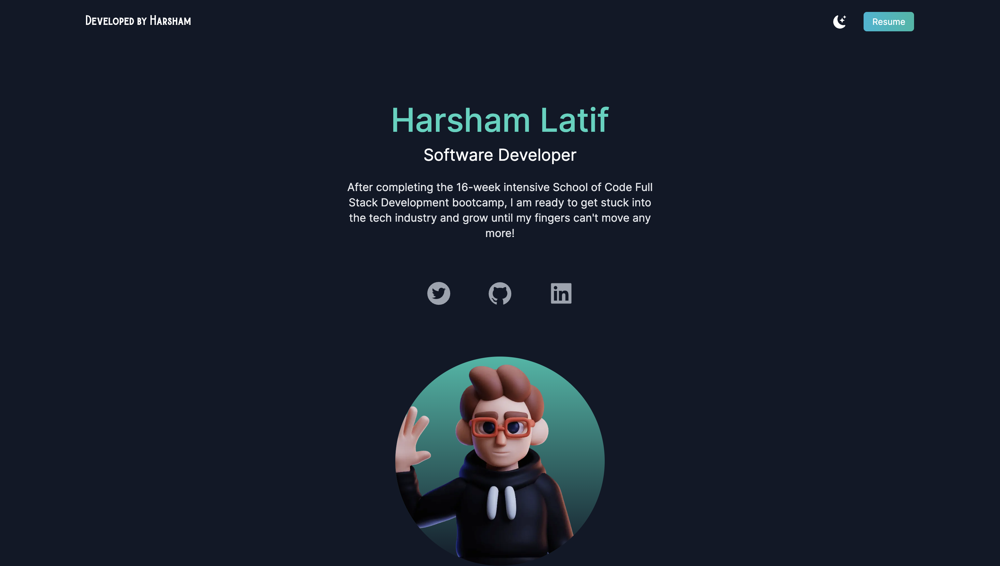
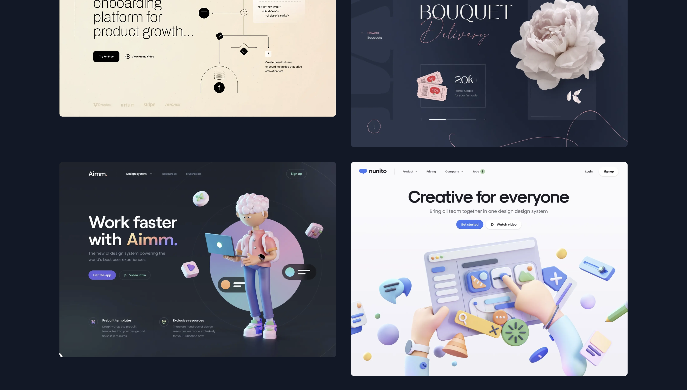
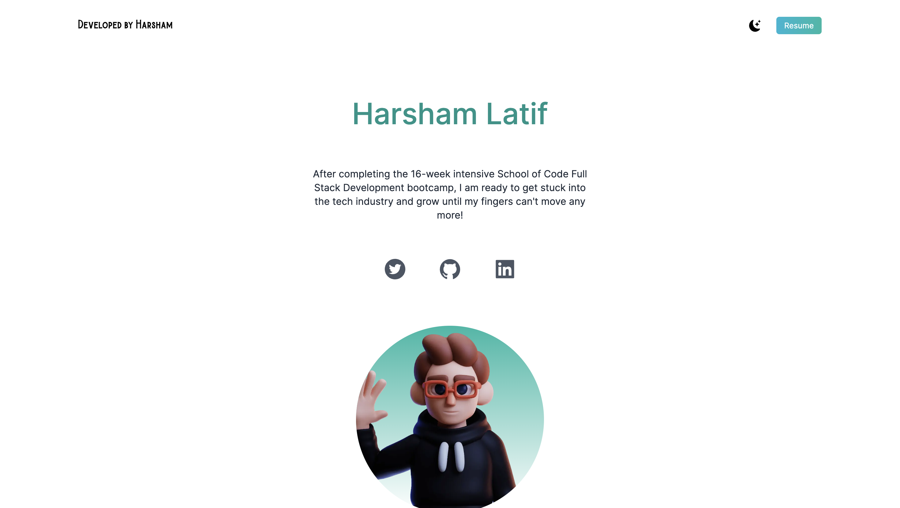
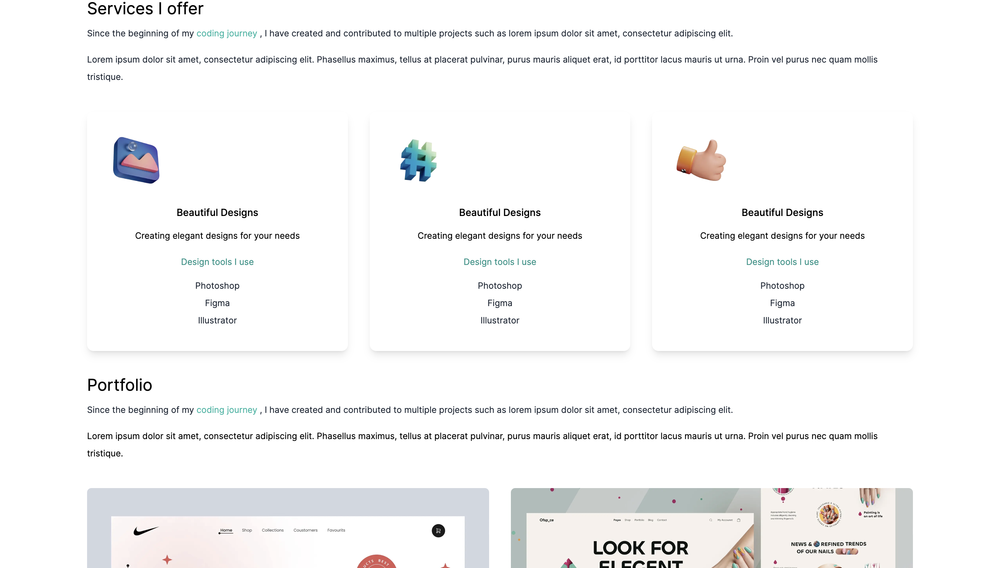

# Personal Portfolio Experimentation🤖

## Description

Within this repository, I went through the process of learning Next.js and Tailwind CSS to expand my knowledge and create a portfolio website. Through the use of Tailwind, I was able to learn closely how to optimise the application so that it worked on screens of varying sizes. By the end of it, I had come to the conclusion that it did not meet my standards of what would be used to represent me and so I have decided to go about creating an alternative portfolio website. Nevertheless, it was an interesting and eye-opening journey that has made me improve as a developer✅

## Demo








## Getting Started

First, run the development server:

```bash
npm run dev
# or
yarn dev
# or
pnpm dev
```

Open [http://localhost:3000](http://localhost:3000) with your browser to see the result.

### Prerequisites

- [Node.js](https://nodejs.org/en/) (>= 19.9.0)
- [NPM](https://docs.npmjs.com/cli/v9/commands/npm-install) (>= 9.6.3)


## Built With

- [React](https://reactjs.org/) - A JavaScript library for building user interfaces
- [Next](https://nextjs.org/) - A a popular open-source framework for building server-rendered React applications.
- [TailwindCSS](https://tailwindcss.com/) - A utility-first CSS framework that can be composed to build any design, directly in your markup.


## Future Improvements & Challenges Faced

- Completion of light/dark mode toggle - issues with useState implementation within Next.js.
- From the very beginning, it was a struggle to understand how Next.js and TailwindCSS even worked in the first place and so understanding this was a huge pain!


## Key Takeaways

- Managed to learn how to effectively implement Tailwind CSS.
- Growing understanding of how Next.js works.
- Improvement on personal CSS/styling ability.
